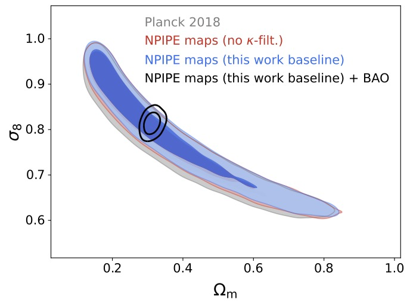
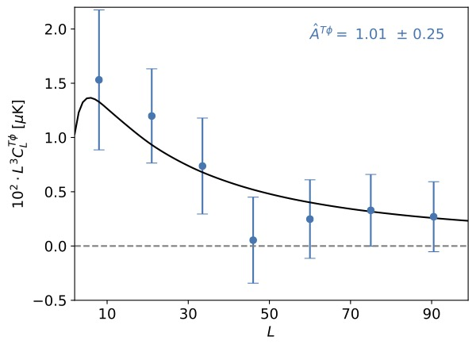

# planck_PR4_lensing
Planck PR4 (NPIPE) lensing likelihoods, by J. Carron, M. Mirmelstein and A. Lewis, together with the Planck PR4 ISW-lensing likelihoods by J. Carron, G. Fabbian and A. Lewis 

This repository contains the Planck lensing and ISW-lensing likelihoods built from Planck PR4(NPIPE) data, in a Cobaya-friendly format.
The lensing likelihoods are slightly more powerful (up to 20%) than the corresponding ones of the PR3 (2018) Planck release.

See [the PR4 paper](https://arxiv.org/abs/2206.07773) for details of the lensing likelihoods.
See [that paper](https://arxiv.org/abs/2209.07395) for details of the ISW-lensing likelihoods.

MCMC chains and 2018-like PR4 lensing maps are available [here](https://github.com/carronj/planck_PR4_lensing/releases/tag/Data)

More maps together with simulations available on NERSC at $CFS/cmb/data/planck2020/PR4_lensing/

Lensing maps variations other than discussed in the PR4 paper are also available or can be made available upon reasonable request.

See [this paper](https://arxiv.org/abs/2007.04997) for the Planck NPIPE maps and [this one](https://arxiv.org/abs/2005.05290) for Cobaya.

Install with

    pip install -e ./ [--user]

